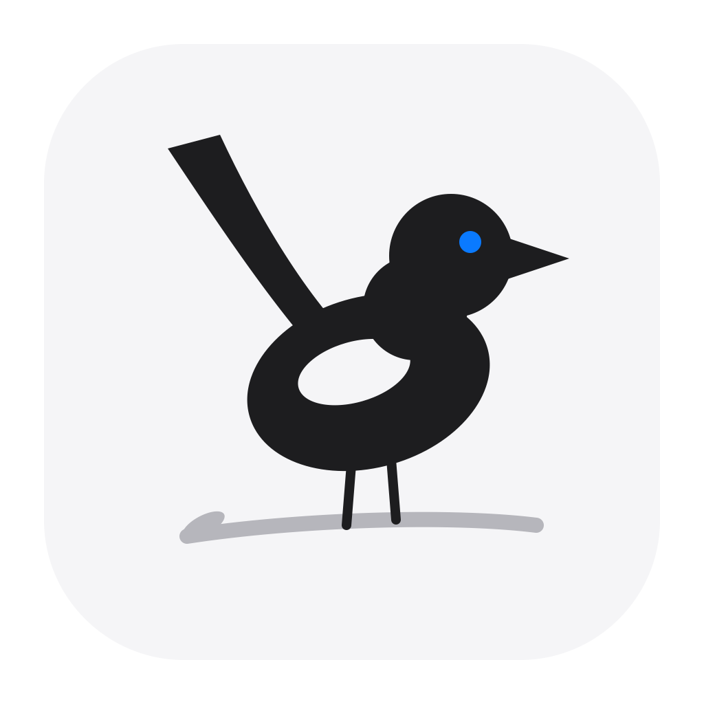
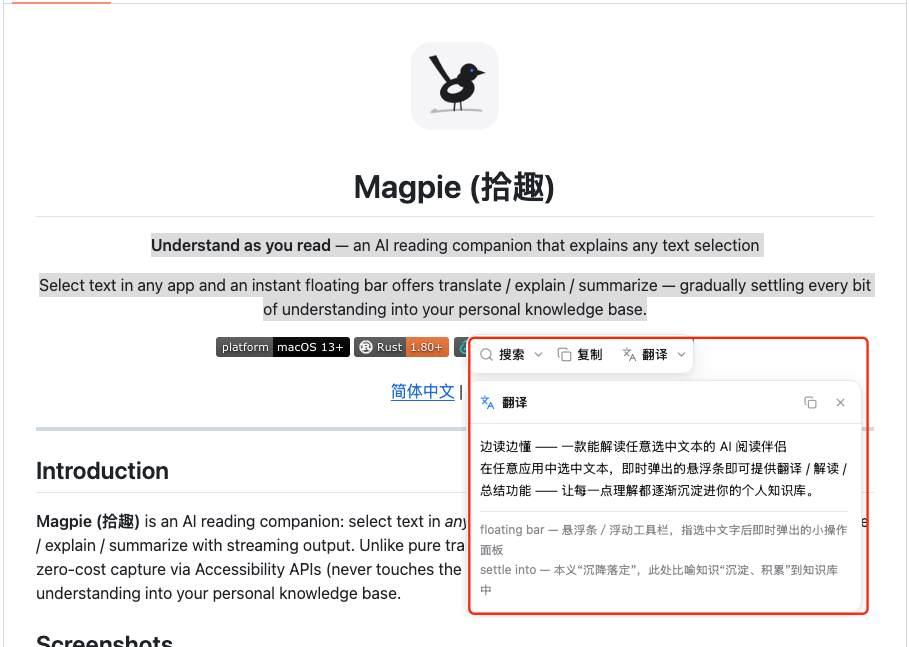
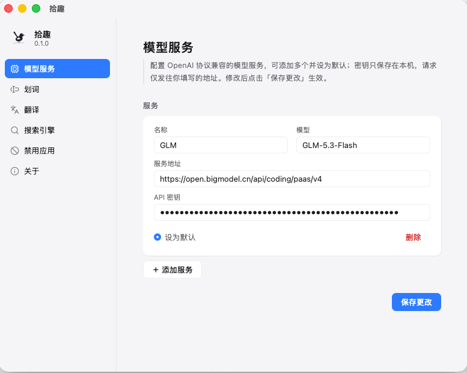
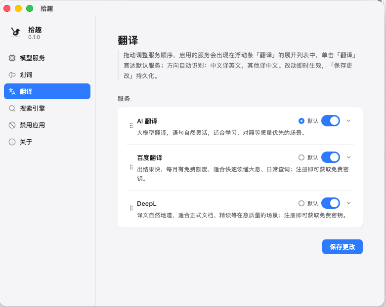
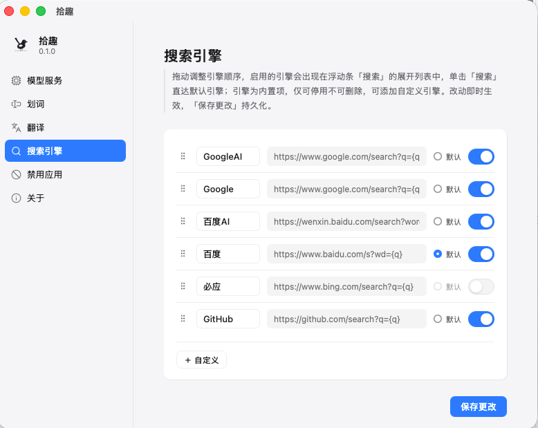

<div align="center">



# 拾趣 (Magpie)

**划词拾趣，阅有所得** —— 划词即理解的 AI 阅读伴侣

在任何应用里选中文字，浮动条即时给出翻译 / 解释 / 总结；未来沉淀为你的个人知识库。

*得于阅，存于思*

[](#)
[](#)
[](#)
[](#)
[](./LICENSE)

[简体中文](./README.zh-CN.md) | [English](./README.md)

</div>

---

## 简介

**拾趣 (Magpie)** 是一款划词即理解的 AI 阅读伴侣。在 macOS 的任何应用里选中文字，浮动条即时提供翻译、解释、总结等 AI 动作，全程流式输出。区别于纯翻译工具，拾趣以「划词 / 阅读轨迹」为中心——零成本捕获（纯无障碍 API，不污染剪贴板）+ 带上下文理解，未来把每一次理解沉淀为个人知识库。

## 截图





<p align="center">
  
  
</p>


## 已实现功能（M1 / MVP）

- **无痕划词** — 基于 macOS 无障碍 API（CGEventTap + AX）全局捕获选中文本，全程不读写剪贴板；拖选或双击即触发，200ms 防抖，同一选区不重复弹出
- **浮动条** — 跟随鼠标弹出、自动防出屏、不抢焦点的毛玻璃胶囊，支持明暗主题
- **五个动作** — 翻译 / 解释 / 总结（AI 流式输出）+ 复制 / 搜索（本地动作），顺序与开关可在设置页调整
- **三种翻译通道** — AI 翻译（大模型）、百度翻译、DeepL；单击直达默认服务，展开列表切换
- **自定义搜索引擎** — 内置百度 AI / 百度 / Google AI / Google / 必应 / GitHub，支持任意 `{q}` 模板引擎
- **BYOK** — 自带 API Key，预设 DeepSeek，兼容任意 OpenAI 协议端点（base_url + key + model 自由填写）
- **菜单栏常驻** — 默认隐藏 Dock 图标，关闭主窗口仅隐藏，捕获继续工作
- **应用黑名单** — 终端、密码管理器等敏感应用内划词不触发，支持自定义

## 环境要求

- macOS 13+（Apple Silicon）
- Xcode Command Line Tools
- Rust 1.80+
- Node 20+
- pnpm

## 快速开始

```bash
# 克隆并安装依赖
git clone https://github.com/<your-org>/shici.git
cd shici
pnpm install

# 开发运行（自动启动 vite :5173）
pnpm tauri dev
```

1. **辅助功能授权（开发模式）**：`tauri dev` 运行的是未打包二进制，不会自动出现在「辅助功能」列表。请把运行 dev 的**终端 App**（Terminal / iTerm2 / VS Code）加入 系统设置 → 隐私与安全性 → 辅助功能；打包成 .app 后无此问题
2. 在**任意应用**里拖选或双击一段文字 → 浮动条出现
3. 打开主窗口「设置」页配置 Provider（预设 DeepSeek，也可填任意 OpenAI 兼容端点）；「翻译」页可配置百度 / DeepL 密钥
4. 点「翻译 / 解释 / 总结」→ 流式结果

## 常用命令

```bash
pnpm check              # TS 类型检查（tsc --noEmit）
pnpm build              # tsc + vite build → dist/
pnpm tauri dev          # 开发运行
pnpm tauri build        # 打包（打包版需授予辅助功能权限）
cargo check             # Rust 检查（在 src-tauri/ 下执行）
cargo build             # Rust 链接验证
```

## 架构

**设计原则：Rust 管不变的，TS 管多变的。**

```
TS (WebView × 2)                        Rust 核心进程
├─ main (index.html)  设置/自检        ├─ capture/  划词捕获（CGEventTap + AX）
│    └─ invoke: get/save_settings      ├─ floating.rs  浮动条窗口定位/显隐
├─ floating (floating.html) 浮动条     ├─ settings.rs  JSON 配置 + 黑名单
│    └─ 动作注册表(ACTIONS)→prompt     ├─ ai.rs  OpenAI 协议 SSE 哑管道
│    └─ aiChat() → Channel 流          └─ main.rs  setup/托盘/事件分发
```

数据流：CGEventTap(鼠标) → detect 线程(防抖/AX 查询) → 过滤(自身 PID/黑名单/重复) → 事件 `selection://captured` → 浮动条弹出 → 用户点动作 → TS 构造 prompt → Rust 转发 SSE → 流式渲染。

- AI 传输走 Rust 哑管道而非 WebView 直连：规避 BYOK 第三方端点的 CORS 限制；prompt / 动作全部在 TS 层（动作注册表：加动作 = 注册一个对象，Rust 零改动）
- 平台分发已抽象：`capture/` 按 `#[cfg]` 选后端，两后端同一签名，Windows (M2) 实现照此接入

## 隐私与安全

- 划词**不读写剪贴板**（纯无障碍 API），剪贴板内容全程不被触碰
- API Key 明文存于本机 `settings.json`（M2 迁移系统钥匙串），仅发送到你自己配置的 LLM / 翻译端点
- 无遥测、无账号体系

## 未来规划

> 架构已为以下能力预留接口（如 `capture/` 平台后端、动作注册表），随里程碑逐步落地。

**M2 — 多平台与更聪明的划词**

- Windows 版捕获（UIA 后端，平台分发接口已预留）
- AI 搜索 + 问一问（多轮对话，tool loop）
- 上下文划词（带选区周边上下文的深度理解）
- 自定义动作（用户在动作注册表上扩展自己的动作）
- 全局快捷键呼出浮动条
- API Key 迁移系统钥匙串

**M3 — 知识库飞轮**

- 划词即收藏，把每一次理解沉淀为个人知识库

**M4 — 免配置**

- 官方托管模型（无需自备 API Key）、账号体系

## 文档

| 文档                                                             | 内容                             |
| ---------------------------------------------------------------- | -------------------------------- |
| [docs/01-PRD-MVP.md](docs/01-PRD-MVP.md)                         | 产品需求、范围、验收标准         |
| [docs/02-架构设计.md](docs/02-架构设计.md)                       | 分层架构、数据流、协议、演进路线 |
| [docs/03-模块设计-划词捕获.md](docs/03-模块设计-划词捕获.md)     | 最高风险模块：CGEventTap + AX    |
| [docs/04-模块设计-窗口与交互.md](docs/04-模块设计-窗口与交互.md) | 浮动条/主窗口规格                |
| [docs/05-模块设计-AI服务层.md](docs/05-模块设计-AI服务层.md)     | 动作注册表、prompt、流式协议     |
| [docs/06-技术选型.md](docs/06-技术选型.md)                       | ADR 决策记录                     |
| [docs/07-MVP执行计划.md](docs/07-MVP执行计划.md)                 | 任务分解与验收状态               |

## License

本项目基于 [MIT](./LICENSE) 许可证发布。
