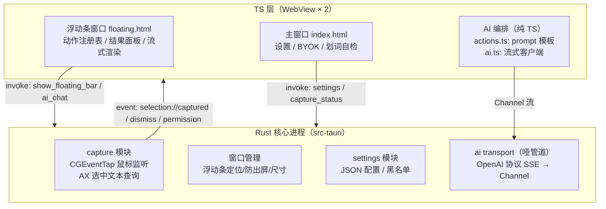
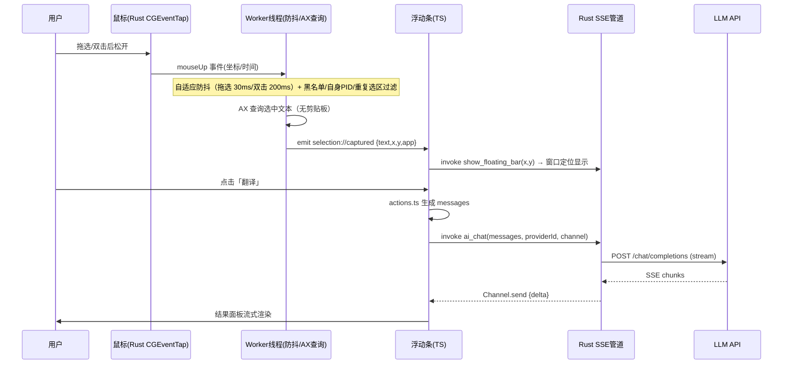

# 拾趣 · 架构设计

> v2.0 · 2026-09-19 · 配套 [01-产品定位与规划](./01-产品定位与规划.md) / [03-模块设计](./03-模块设计.md) / [04-技术选型](./04-技术选型.md)

## 1. 总体原则

1. **Rust 管不变的，TS 管多变的**：系统层（捕获/窗口/存储/传输）放 Rust——五年不随 AI 演进变化；AI 编排（动作、prompt、流式渲染、未来 agent）放 TS（WebView 内）——蹭 npm 生态的迭代速度。
2. **无障碍优先**：数据获取默认只走无障碍 API；兼容模式（常开兜底）在 AX 失败时模拟 ⌘C 取词并自动还原剪贴板。
3. **热路径零框架**：划词→弹条→流式首字这条链上不引入任何 AI 框架，保证延迟与体积。
4. **契约面最小**：Rust ↔ TS 之间只通过 Tauri command（请求/响应）+ event + Channel（流）三种通道通信，接口数刻意保持在个位数。

## 2. 分层架构



### 进程与窗口模型

| 窗口 | label | 特性 | 生命周期 |
|---|---|---|---|
| 主窗口 | `main` | 760×560，常规装饰 | 常驻（可关闭=隐藏） |
| 浮动条 | `floating` | 无边框/透明/置顶/不进任务栏/不抢焦点 | 常驻隐藏，选词时 show + 定位 |

> 浮动条采用「预建 + show/hide」而非每次 new window：省 50~100ms 创建延迟。

## 3. 关键数据流

### 3.1 划词→弹条→流式结果（热路径）



### 3.2 事件与命令协议（Rust ↔ TS 契约）

**Events（Rust → TS）**

| 事件 | 载荷 | 说明 |
|---|---|---|
| `selection://captured` | `{text, x, y, app}` | 有效新选区 |
| `selection://dismiss` | `{}` | 单击空白（浮动条可见时才发），浮动条隐藏 |
| `capture://permission` | `{granted}` | 辅助功能授权状态变化（启动/自检时查询后发） |

**Commands（TS → Rust）**

| 命令 | 参数 | 返回 |
|---|---|---|
| `show_floating_bar` | `x, y` | 定位并显示：跟随鼠标上方（胶囊水平中心对光标、卡片底边距光标 16px，屏顶放不下落到下方），含防出屏钳制 |
| `resize_floating` | `width, height` | 展开结果面板时调整尺寸并保持不出屏 |
| `hide_floating_bar` | — | 隐藏 |
| `ai_chat` | `messages, providerId?, channelId` | 建 SSE 请求，流经 Channel 推送 |
| `get_settings` / `save_settings` | — / `settings` | JSON 配置读写 |
| `capture_status` | — | `{granted, axServiceOk, listenEventAccess, platform}` |
| `request_listen_access` | — | 发起输入监控授权（系统自动注册二进制）；未通过时代开设置面板 |
| `open_accessibility_settings` | — | 打开系统设置隐私面板 |
| `list_apps` | — | 前台应用名（自检页用，M2 扩展为运行中应用列表） |
| `entities::detect_dates` | `text` | NSDataDetector 日期实体识别（离线/确定性，中文相对时间对照当天解析），返回 `[{unix, duration, start, len}]` |
| `entities::detect_places` | `text` | NLTagger（NaturalLanguage 框架）地名 NER，`nameType` 方案的 PlaceName 标签，离线 on-device；返回地名 span 字符串数组 |
| `entities::open_in_calendar` | `start, end, title, allDay` | 本地拼 .ics 交给系统日历（预填新事件）；时间串由 TS 计算传入，零 EventKit 权限 |
| `notify` | `message, kind?` | 全局 toast 轻提示（前端侧唯一提醒通道：WKWebView 不实现 `alert/confirm`，它们是静默空操作） |

**Channel 流消息（ai_chat）**

```jsonc
{ "type": "delta",  "content": "…" }   // 增量文本
{ "type": "done",   "usage": {...} }   // 正常结束（含 token 用量，可空）
{ "type": "error",  "message": "…" }   // 网络/鉴权/中止错误
```

## 4. 存储模型（MVP）

- `~/Library/Application Support/app.magpie.desktop/settings.json`（Rust serde 读写，内存 Mutex 缓存；曾用 identifier `app.shici.desktop`，首次启动自动把旧目录配置迁移到新目录）

```jsonc
{
  "providers": [{ "id": "p1", "name": "DeepSeek", "base_url": "https://api.deepseek.com",
                   "api_key": "sk-…", "model": "deepseek-chat" }],
  "default_provider_id": "p1",
  "actions": { "translate": true, "explain": true, "summarize": true },
  "app_blacklist": ["com.apple.Terminal", "com.apple.Passwords"],
  "debounce_ms": 200
}
```

> 安全注记：MVP 将 Key 明文存于本机配置文件（与竞品普遍水平一致）；M2 迁移到系统钥匙串（keyring crate），已在 [03-模块设计 §C](./03-模块设计.md) 留有接口位。文档与 UI 需明示此现状。

## 5. 安全与隐私设计

1. **权限最小化**：仅申请辅助功能权限（macOS），用途在首次引导页讲清楚。
2. **密钥不进前端持久层**：Key 只在内存中经 command 传给 Rust 管道；WebView 的 localStorage 不存 Key。
3. **CSP**：生产构建启用严格 CSP；WebView 无远程内容加载。
4. **数据流向透明**：MVP 仅「选中文本 + prompt」发送至用户自配的 LLM API，无任何遥测（未来加遥测须默认关闭）。

## 6. 演进路径（架构预留）

| 阶段 | 增量 | 架构落点 |
|---|---|---|
| M2 | Windows UIA 捕获 | `capture/` 下平台后端 trait 已抽象，见 [03-模块设计 §A](./03-模块设计.md) |
| M2 | AI 搜索/问一问（tool loop） | TS 层引入 Vercel AI SDK（或自建 loop），`ai_chat` 管道原样复用；传输如需浏览器直连再评估 plugin-http |
| M2 | 上下文划词（周边段落） | AX 查询从 `SelectedText` 扩展到范围+容器文本，事件载荷加 `context` 字段 |
| M3 | 统一动作模型：自定义 AI 动作 + 接入动作（划词收藏）+ workflow | 动作注册表升级为"内置 + 用户数据"合并渲染；新增 action 类型：URL scheme / AppleScript 模板与 AI 自定义 prompt；接入动作无状态一次性送达（产品原则见 [01 §4/§6](./01-产品定位与规划.md)），不建 Rust 侧收藏存储 |
| M4 | 深度研究模式 | Node sidecar（deepagents）按需拉起，注册为 TS 层的一个"重动作" |
| M4 | 官方托管 | Provider 抽象加 `type: "hosted"`，走账号体系 |

## 7. 技术风险与对策

| 风险 | 等级 | 对策 |
|---|---|---|
| AX 在部分应用拿不到文本 | 高（固有） | 静默失败 + 自检页预期管理 + 兼容模式（常开的 ⌘C 兜底，已实现） |
| 浮动条多显示器 DPI 定位 | 中 | 统一 Logical 坐标换算 + 防出屏钳制，双屏实测纳入验收 |
| SSE 管道的中断/超时处理 | 中 | 管道层统一 error 事件 + 前端重试按钮；请求 60s 超时 |
| CGEventTap 被系统禁用（空闲超时） | 低 | listen-only tap 不修改事件基本不会被禁；启动与 resume 时自检重建 |
| Key 明文存储 | 中 | M2 迁 keyring；README 明示 |
